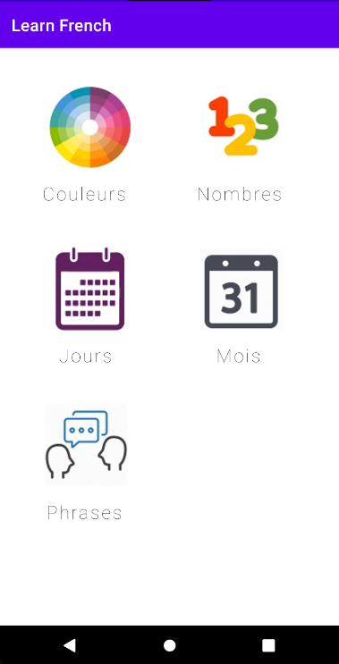
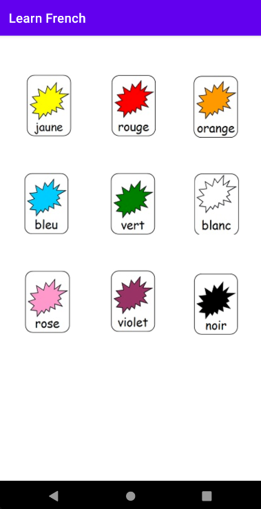
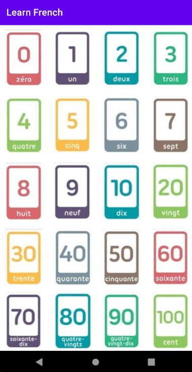
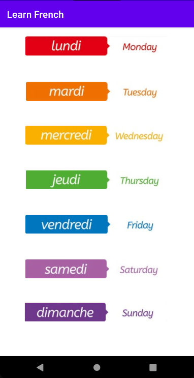
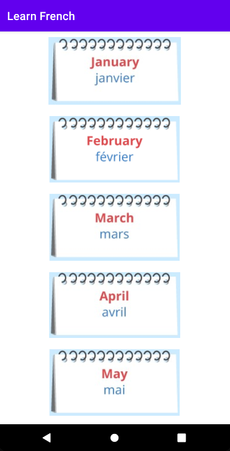
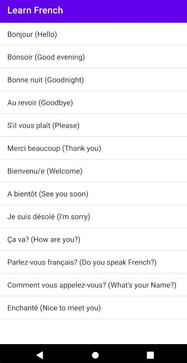

# LearnFrench app

The main idea behind the application is to teach basic words and phrases in French. It consists of six activies, five of which contain words from different categories(Colors, Numbers, Days of the week, Months and Phrases).

## MainActivity
The MainActivity includes five image buttons, each of them lead to the activity it corresponds to. Below the buttons are text views that clarify further which category of words is represented in the activity. 

## ColorsActivity
Consists of image buttons representing different colors. When you click a button, it spells the word for you. The activity supports portrait and landscape rotation. 

## NumbersActivity
Consists of image buttons representing numbers. When you click a button, it spells out the word for you. The activity supports portrait and landscape rotation. Scrollview layout is used for landscape mode.

## DaysActivity
Consists of image buttons representing the days of the week. When you click a button, it spells the word for you. The activity supports portrait and landscape rotation. 

## MonthsActivity
Consists of image buttons representing the months of the year. When you click a button, it spells the word for you. The activity supports portrait and landscape rotation. Scrollview layout is used for both portrait and landscape mode.

## PhrasesActivity
Consists of several phrases in French and their translations in English. The phrases and the sounds for their pronounciations are pulled from  two arrays(string[] phrases, int[] sounds), Listview layout is used to show them in order. When you click on a phrase from the listview, you can hear the pronounciation. The activity supports portrait and landscape rotation.

